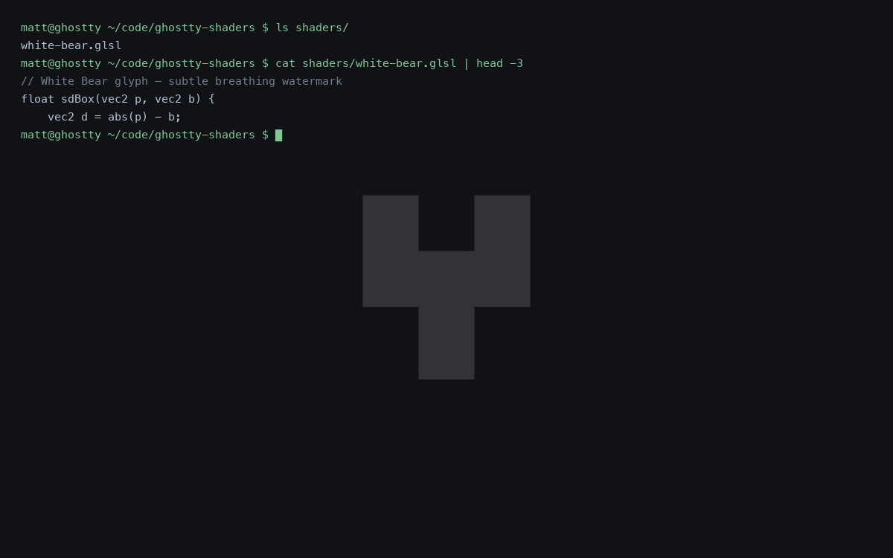

# ghostty-shaders

A small gallery of custom GLSL shaders for the [Ghostty](https://ghostty.org/) terminal.

Ghostty supports Shadertoy-format fragment shaders as background effects via the `custom-shader` config option. This repo collects ones I've built, with a headless renderer script so each shader has a reproducible preview image.

## Gallery

### White Bear

A subtle breathing watermark of the [White Bear glyph](https://blackmirror.fandom.com/wiki/White_Bear_Symbol) from the Black Mirror episode. Centered, faint grey, ~10s opacity pulse. Designed to be unobtrusive enough to leave text crisp.



- Shader: [`shaders/white-bear.glsl`](shaders/white-bear.glsl)

## Installation

1. Clone or download the `.glsl` file you want.
2. Put it somewhere readable, e.g. `~/Library/Application Support/com.mitchellh.ghostty/shaders/` on macOS.
3. Point Ghostty's config at it:

   ```
   # ~/Library/Application Support/com.mitchellh.ghostty/config  (macOS)
   # or ~/.config/ghostty/config  (Linux)

   custom-shader = /absolute/path/to/white-bear.glsl
   custom-shader-animation = true
   ```

4. Restart Ghostty (or `Cmd+Shift+,` to reload config).

`custom-shader-animation = true` is required for any shader that uses `iTime` — otherwise the shader only re-renders when the terminal contents change and animations will appear frozen.

## Writing your own

Ghostty shaders follow the [Shadertoy](https://www.shadertoy.com/howto) format: define a `mainImage(out vec4 fragColor, in vec2 fragCoord)` function. Available uniforms include `iResolution`, `iTime`, and `iChannel0` (the terminal contents as a 2D texture).

Minimal template:

```glsl
void mainImage(out vec4 fragColor, in vec2 fragCoord) {
    vec4 term = texture(iChannel0, fragCoord / iResolution.xy);
    // ... your effect here, then composite over term ...
    fragColor = term;
}
```

Always sample and composite over `iChannel0` — otherwise you'll wipe out the terminal contents.

## Previewing shaders

The repo includes a headless renderer (`tools/render.py`) that compiles a Ghostty shader against a fake terminal background and writes a PNG. It uses Python via [`uv`](https://docs.astral.sh/uv/) — no manual venv or `pip install` needed; deps are declared inline in the script.

```bash
uv run tools/render.py shaders/white-bear.glsl previews/white-bear.png
uv run tools/render.py shaders/white-bear.glsl previews/white-bear-bright.png --time 2.5
uv run tools/render.py shaders/foo.glsl out.png -w 1600 -H 1000 -t 4.0
```

Flags:
- `-w / -H` — output resolution (default 1200×750)
- `-t / --time` — value of `iTime` (controls animation phase)

The renderer provides a fake dark-terminal `iChannel0` so you can see how your shader composites over real text without needing a live terminal capture. For genuine in-context shots, just `Cmd+Shift+4` your own Ghostty window.

## Contributing

PRs welcome. Drop your shader in `shaders/`, generate a preview to `previews/`, and add an entry to the gallery section above.

## License

MIT — see [LICENSE](LICENSE).
